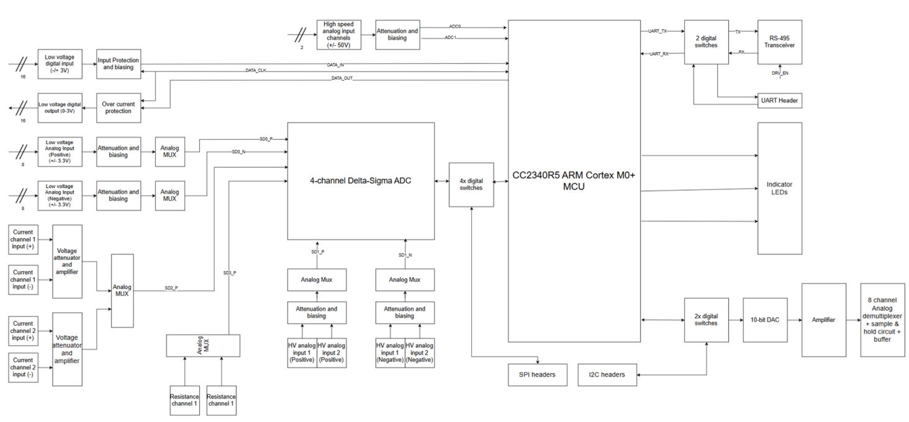

# bluetooth-daq
A simple low-speed Bluetooth enabled DAQ consisting of HV/LV voltage, current measurement, LV analog I/O, resistance measurement, UART, I2C & SPI communication interfaces and a high speed ADC combining multiple functionalities within one device. The device can be operated through a mobile/PC application via Bluetooth or through RS-485 interface. 16 devices can be connected to the RS-485 interface.

## Goal of the product
1. Reduce the number of induvidual electronic test equipment required for electronic hardware/software development.

2. Combine commonly used electronic test functions within a single device

3. Enable versatile interface to the device (RS485, Bluetooth, Web) and test automation support to reduce effort of manual testing.

## Features of the product

### Hardware features

1. 16 low-speed logic level digital inputs (+/ 3.3V)
2. 16 low-speed logic level digital outputs (0-3V) with maximum current limit of 5mA / channel.
3. 2 channel bi-polar differential high-resolution analog inputs (+/-, 50V, 6 digits) with maximum sampling rate of 2 kSPS/channel in single channel sampling mode.
4. 2 channel high speed bipolar differential analog acquisition channels (maximum input signal frequency of 10kHz)
5. 1 UART communication instance (UART_TX, UART_RX) with maximum baud rate of 115200.
6. 1 I2C communication instance (I2C_SDA, I2C_SCL) with maximum clock speed of 400 kHz.
7. 1 SPI communication instance (SPI_MOSI, SPI_MISO, SPI_nCS, SPI_SCLK) with maximum clock speed of 4 MHz.
8. 8 channel differental bi-polar low voltage analog inputs with 12-bit resolution and +/- 10V range.
9. 2 current measurement inputs (+/- 50V common mode voltage, and maximum current of 3A).
10. 2 resistance measurement inputs ( 1 ohm to 1 MOhm ).
11. RS-485 interface for remote control.

### Software features

1. RS-485 control of device through PC.
2. Bluetooth control of device from PC/Mobile application.
3. Firmware upgrade through Bluetooth using TI Simplelink Connect app.
4. Simple Web GUI interface for control of device.
5. Python scripting support for remote control of device from PC.
6. LabVIEW support for the device.

## Hardware block diagram

## Software block diagram

